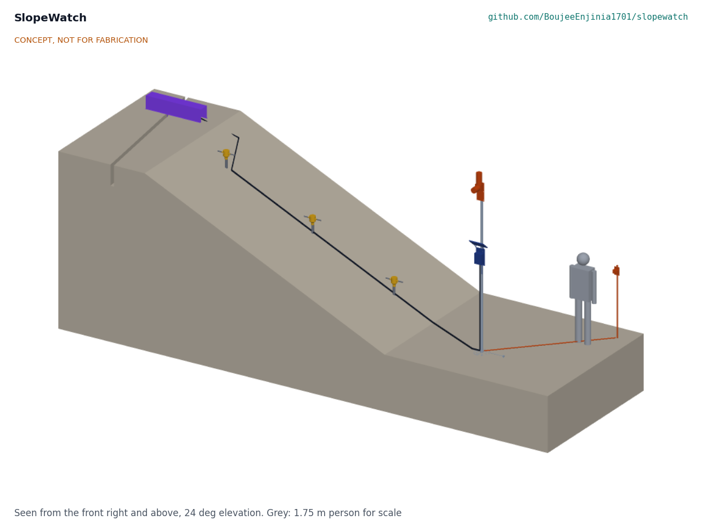
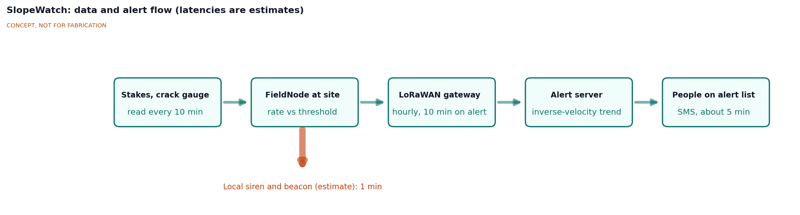
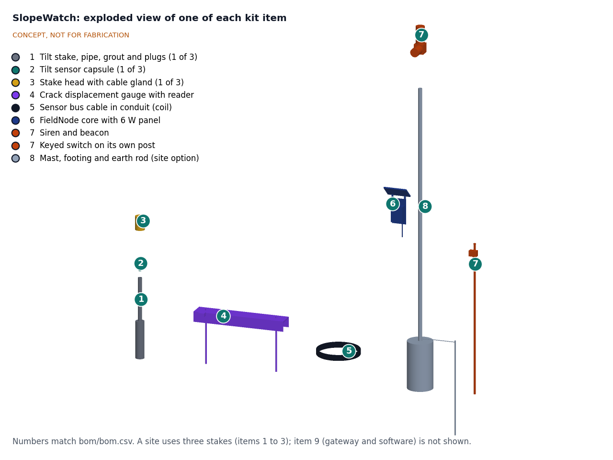
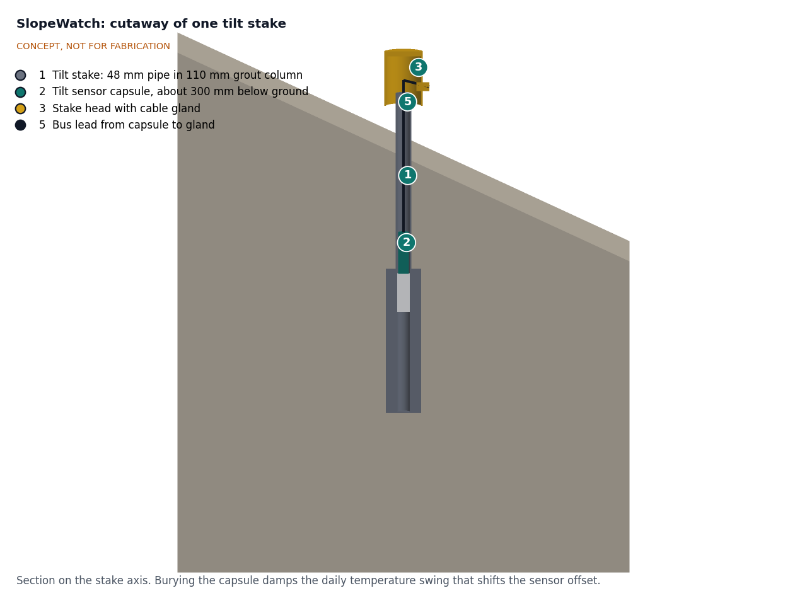

# SlopeWatch design precis

SlopeWatch watches a slope for accelerating movement with three grouted tilt stakes and a crack gauge, cabled to one FieldNode core on an existing pole (or an optional mast) at the toe, and sounds a siren and beacon on site when the tilt rate passes a warning threshold, while sending an SMS through LoRaWAN. The TRL 3 calculations (SLW-CAL-001) show that the inclinometer resolves the tilt-rate thresholds with a wide margin, that a capsule 0.4 m deep keeps temperature drift within R2 even in wet soil, that the siren starts about 13 s after a confirmed warning, and that the FieldNode cell covers five sunless days with an alarm. Amish accepted the recommended choices on 2026-09-25 (SLW-DDR-002): the reference site uses an existing pole, with the mast as a site option, and the keyed silence switch stands on its own post about 5 m from the siren. Making the design physically buildable (SLW-DDR-003, accepted by Amish on 2026-10-02) added end caps, stand tubes and centring collars to the stakes, stake heads from stock drainage fittings with conduit fittings, clamp blocks and ball joints on the crack gauge, and a pole mounting for the alert unit; the prototype build plan is SLW-BLD-001. Value-engineering target: USD 250. Estimated cost of the constructable design: USD 296.50 for the SlopeWatch-specific parts of the reference site (USD 46.50 over the target), or $324.50 where a new mast is needed; the FieldNode core ($126) is costed in its own project. The main risks are siren reach near machinery, the unrated FieldNode 12 V rail current and the remote alert time at the slowest radio setting.

*Figure 1. SlopeWatch on a 25 degree slope (spacing compressed for the picture; the reference site has stakes 10 m apart): three tilt stakes on the fall line, a crack gauge (purple) across a tension crack at the crest, the mast (a site option; an existing pole in the reference site) with FieldNode core, siren and beacon at the toe, and the keyed switch on its own post. Grey figure: 1.75 m person for scale.*

## How it works

1. **Sense tilt.** Each tilt stake is a 48 mm steel pipe grouted 0.8 m into the slope's surface layer. A sealed capsule with a MEMS inclinometer sits inside the pipe 0.4 m below ground, between two foam plugs. When the surface layer creeps downslope, the stake rotates with it; the approach and its thresholds follow Uchimura et al. ([2015](https://www.sciencedirect.com/science/article/pii/S0038080615001122)).
2. **Sense cracks.** A crack gauge spans a tension crack near the crest, where movement often shows first: two anchor pins either side of the crack and a 100 mm linear displacement sensor between them, under a guard, with a small reader board that puts the gauge on the same bus as the capsules.
3. **Collect.** A four-core cable in conduit links all sensors on an RS-485 bus to one of the FieldNode core's M12 ports, powered from its 5 V rail. Every 10 min the node switches the bus on for about 12 s, reads a 10 s average from each capsule and the gauge, and switches it off.
4. **Decide.** The node computes the tilt and opening rate for each sensor and runs the alert rules below. Raw readings are kept on the node's flash for at least 90 days.
5. **Alarm.** In the warning state the node drives the siren and beacon through the second M12 port from its 12 V rail, with no network needed, and raises its uplink rate from hourly to every 10 min.
6. **Notify and review.** Readings reach any LoRaWAN server (the lab's TwinKit gateway or The Things Network). An open alert service sends SMS or app messages to named people and plots inverse velocity against time ([Fukuzono, 1985](https://www.jstage.jst.go.jp/article/jls1964/22/2/22_2_8/_article)) for the engineer.

*Figure 2. Data and alert flow for one site. The local siren path does not depend on the network. All latencies are estimates.*

### Alert rules

The tilt rules below were decided by Amish on 2026-09-25 (SLW-DDR-001 D6, SLW-DDR-002). The crack-opening thresholds are placeholders. A geotechnical partner sets the thresholds per site before any alarm goes live; until then the tilt-rate thresholds and the crack placeholders are used for logging only, not for public alarms (decided by Amish, 2026-10-02; SLW-DDR-001 O3).

Table 1. Alert states.

| State | Entered when | Action |
| --- | --- | --- |
| Normal | No condition below | Read every 10 min; uplink hourly |
| Precaution | Any stake tilts faster than 0.01 degrees per hour averaged over 3 h, or the crack opens faster than 1 mm per day over 24 h (placeholder) | Uplink every 10 min; message to the site manager and engineer; beacon flashes slowly at 1 % duty or less (for example 100 ms every 10 s) |
| Warning | Any stake tilts faster than 0.1 degrees per hour over 1 h, confirmed on two consecutive readings, or the crack opens faster than 1 mm per hour (placeholder) | Siren and fast beacon on site; SMS to everyone on the list; inverse-velocity plot flagged |
| Silenced | Keyed switch on its post about 5 m from the mast | Siren off for 30 min, beacon stays on; the node re-arms automatically |

## Main components

Numbers match the exploded view (Figure 3) and `bom/bom.csv`.

Table 2. Main components.

| # | Component | Choice (decided by Amish, 2026-09-25) | Notes |
| --- | --- | --- | --- |
| 1 | Tilt stake (3 per site) | 48.3 x 3.2 mm galvanized steel pipe, 1.0 m long, 0.8 m in ground, screwed end cap, lower 450 mm in a 110 mm grout column | Couples the stake to the surface layer; steel passes R2 (SLW-CAL-001, section B) |
| 2 | Tilt sensor capsule (3) | Murata SCL3300 inclinometer in mode 1, small microcontroller, RS-485 transceiver and 3.3 V regulator, potted in a 34 x 130 mm tube with two centring collars | Sits 0.4 m below ground on a stand tube, under a foam plug, to damp temperature swings |
| 3 | Stake head (3) | 110 mm PVC drainage reducer, pipe and cap, with conduit fittings for the bus in (upslope) and out (downslope) | Keeps rain out of the pipe; joins the capsule to the bus; marks the stake: signal amber with a retroreflective band, a stake ID label and a downslope arrow on the crown (decided 2026-10-02) |
| 4 | Crack displacement gauge | 100 mm linear potentiometer displacement sensor on ball joints between clamp blocks on two anchor pins, under a folded guard, with an RS-485 reader | Re-settable when the crack opens past range |
| 5 | Sensor bus cable | Four-core shielded outdoor cable (power and RS-485) in corrugated conduit, about 60 m | Surface-laid in the prototype; buried in conduit where the ground allows, armoured cable only across rockfall zones; a fault message whenever a stake stops answering (decided 2026-10-02) |
| 6 | FieldNode core | Lab shared node: IP65 box, 6 W panel, LiFePO4 3.2 V 6 Ah, MPPT charger, STM32WL-class LoRaWAN radio, two M12 ports | Costed in the FieldNode project (SLW-DDR-001 D1) |
| 7 | Siren and beacon alert unit | 12 V piezo siren, about 110 dB(A) at 1 m, and an amber LED beacon, switched by the node, in an alert box on a back plate clamped to the pole with V-blocks and band clamps | Keyed silence switch on its own post about 5 m from the mast, on a 7 m lead (SLW-DDR-002) |
| 8 | Mast and footing (site option) | 48.3 x 3.2 mm galvanized pipe, 3.2 m above ground, in a 320 mm x 0.6 m concrete footing, with an earth rod | Only where no existing pole or building can carry the node (SLW-DDR-002); built for the first prototype; 60.3 mm pipe for site installations unless local gust data show winds well below 35 m/s (decided 2026-10-02) |
| 9 | Gateway and alert software | Any LoRaWAN server; open alert service with SMS and inverse-velocity plot | Not shown in the media; gateway (TwinKit, about $290) not in site cost |

*Figure 3. Exploded view of one of each kit item, with numbered callouts matching the BOM. A site uses three stakes (items 1 to 3).*

*Figure 4. Section through one tilt stake on its axis, showing the grout column, the capsule 0.4 m below ground between foam plugs, and the lead to the cable gland.*

The general arrangement drawing [SLW-DWG-001](../cad/drawings/SLW-DWG-001.pdf) (Rev P4) gives the main dimensions of the stake, crack gauge, mast and switch post, generated from the parametric model `cad/src/model.py`.

## Key numbers (SLW-CAL-001)

All values are calculations for a paper proof of concept, from `docs/04-calcs/sizing.py`. They replace the TRL 2 estimates.

Table 3. Key numbers and requirement status.

| Quantity | Value | Requirement |
| --- | --- | --- |
| Inclinometer output step; noise over a 10 s average | 0.0055 degrees; 0.00054 degrees (mode 1, ±90 degrees) | R1 met on paper |
| Tilt-rate noise over 1 h | 0.00061 degrees per hour, 164 times below the warning rate | |
| Thermal drift, capsule 0.4 m deep, wet soil | 0.0092 degrees per day, peak 0.0012 degrees per hour | R2 met on paper |
| Same at 0.3 m (TRL 2 depth), wet soil | 0.0170 degrees per day, peak 0.0022 degrees per hour | Would miss R2 |
| Crack gauge step; thermal swing of the gauge | 0.024 mm; 0.39 mm per day (precaution rate taken over 24 h) | R3 met by design |
| Airtime per uplink | 0.45 s (SF10), 1.81 s (SF12); 0.30 % of time at SF12 | R4 met on paper |
| Confirmed warning to siren | about 13 s | R5 met by design |
| Warning to SMS | 1.6 min at the first try; 4.6 min at SF12 with one lost uplink | R6 at risk |
| Siren at 100 m | 65.5 to 68.5 dB(A) in open ground; about 5 m of reach over running plant | R7 at risk |
| Sensor load; precaution load | 2.67 mW; 29.8 mW with the beacon at 1 % duty | Within the FieldNode 100 mW allowance |
| 30 min alarm | 3.00 Wh, 0.45 A at 12 V, 2.00 A from the cell | R8 at risk on rail current |
| 5 sunless days in precaution with one alarm | 7.3 Wh of 13.1 Wh usable at -10 °C | R8 met on energy |
| Bus cable; voltage drop | 59.2 m; 0.096 V on the 5 V rail | |
| Mast in a 35 m/s gust (alert unit side-mounted) | 136 MPa (factor 1.7); footing factor 2.2 | |
| Siren level at the keyed switch | about 95 dB(A) on its post 5 m away (42 min NIOSH allowance); about 106 dB(A) on the mast (4 min) | Safety |
| Stake installation | 44 min estimated; 3.7 L of grout | R10 not verifiable at TRL 3 |
| 90 days of raw data | 363 kB | R12 met on paper |

### Cost

Table 4. Parts cost for the reference site (see `bom/bom.csv`). Value-engineering target: USD 250 (`budget_usd`, a hypothetical control target, not a limit). Estimated cost of the constructable design: USD 296.50 (USD 46.50 over the target).

| Group | Cost | Requirement |
| --- | --- | --- |
| Stakes, capsules and heads (items 1 to 3, three sets) | $154.50 | |
| Crack gauge with reader, cable, alert unit with switch post, consumables (items 4, 5, 7, 10) | $142.00 | |
| **SlopeWatch-specific parts, reference site (existing pole)** | **$296.50** | R11 over the value-engineering target by $46.50 |
| Optional mast and footing (item 8), where no pole exists | +$28, giving $324.50 | Site option (SLW-DDR-002) |
| FieldNode core (item 6, costed in FieldNode) | $126 | Outside R11 |
| Reference site total with FieldNode | $422.50 | |
| LoRaWAN gateway, if the site has no coverage | not in site cost (TwinKit gateway about $290) | |

## Key design choices

Amish accepted every recommended choice on 2026-09-25 ("i accept all your recommendations, go with them across all repos"), recorded in SLW-DDR-002. Each choice below is decided by Amish, 2026-09-25: go with recommendation.

- **Budget (D1).** The FieldNode core is costed in its own project, as SunSpoke does with the SwapCell pack; the $250 value-engineering target covers SlopeWatch-specific parts.
- **Reference site on an existing pole (DDR-002 item 4).** The node and alert unit go on an existing pole or building; the mast and footing (item 8) are a site option. This closed the $11 gap that a new mast left at the time.
- **Tailings dams in the pitch (D2).** Kept, with the scope limits in SLW-PRB-001 stated in every document: supplementary layer only, installed with the owner's and engineer of record's permission, no claim to detect brittle failure.
- **Surface tilt stakes plus a crack gauge (D3),** rather than borehole in-place inclinometers (deep movement, but a drill rig and far higher cost), GNSS receivers (costly and slower to resolve millimeters) or crack gauges alone.
- **Wired bus to one FieldNode (D4).** About $41 per extra stake plus cable, against a FieldNode on every stake. A wireless stake variant is recorded for later.
- **Inclinometer (D5).** SCL3300 in mode 1, with an ADXL355-class accelerometer as the fallback.
- **Alert rules (D6).** The published 0.01 and 0.1 degrees per hour tilt-rate thresholds as defaults; warning on one stake confirmed on two consecutive readings (20 min); keyed 30 min silence that re-arms. Site values are set by an engineer after a baseline period. The precaution beacon flashes at 1 % duty or less (DDR-002 item 7).
- **Alert unit location (D7).** On the pole or mast at the toe; a second unit near the work face or in the village, linked by LoRa, as an option after co-design. At sites with running machinery the second unit at the work face is required (decided 2026-10-02).
- **Wall and timber pole fixing (decided 2026-10-02).** Both back plates get four wall holes so the node and the alert unit can be coach-screwed to a timber pole or wall; the change is to be agreed with FieldNode.
- **M12 pinout (decided 2026-10-02).** FieldNode's candidate pinout (pin 1 switched rail, pin 2 data A, pin 3 ground, pin 4 data B, pin 5 analog): SlopeWatch uses 12 V on pin 1, the bus on pins 2 and 4, and the keyed switch input on pin 5 of port B.
- **Keyed switch on its own post (DDR-002 item 6).** The switch box stands on a 26.9 mm post about 5 m from the siren, on a 7 m lead in conduit, where the siren gives about 95 dB(A) instead of about 105 dB(A) under it (SLW-CAL-001, section E).
- **Own gateway at SF12 sites (DDR-002 item 8).** A site whose uplinks need SF12 uses a TwinKit gateway, because hourly uplinks at SF12 exceed The Things Network's 30 s daily fair use.
- **Changes from the calculations.** The capsule sits 0.4 m deep with foam plugs; the crack gauge has its own reader; the crack precaution rate is taken over 24 h.

## Safety

> **Safety:** SlopeWatch is installed on ground that may already be moving and is meant to protect people from a slope failure. The two main hazards are harm to the installers and false confidence in the system. It is a research prototype and does not replace engineered monitoring, a trigger action response plan or evacuation planning.

- **Working on unstable slopes.** Install and service only with a partner's trained team, after a visual check by a competent person; never work below an actively moving face, below overhanging material or on a tailings dam crest or face without the owner's permit and the engineer of record's approval. Use a spotter, keep an escape route clear, and stop work in or after heavy rain.
- **False confidence and missed warnings.** A system that is silent is not proof of a safe slope. Brittle failures, failures deeper than the stakes, failures between stakes, earthquakes and heavy rain can all bring a slope down with little surface warning. Every site sign, SMS and document must say what SlopeWatch cannot detect. Flat batteries, cut cables and silenced sirens must raise a fault message.
- **False alarms.** Repeated false alarms teach people to ignore the siren. Thresholds and confirmation rules must be set with the community and a geotechnical partner, per site, before any alarm goes live, and reviewed after each alarm; until then the system logs only.
- **Lithium cell.** The FieldNode core holds a 19 Wh LiFePO4 cell, which supplies about 2 A during an alarm. Use the FieldNode's fuse and cold-charge lockout, do not charge a damaged cell, and keep the box out of standing water.
- **Cement grout.** Wet cement is alkaline and can burn skin and eyes. Wear gloves and eye protection and wash off splashes at once.
- **Mast and height.** The prototype's 48.3 mm mast has a factor of 1.7 on yield in a 35 m/s gust: use it only on a fenced test slope and keep everyone from under it in high wind; site installations use the 60.3 mm mast unless local gust data show winds well below 35 m/s. Where the optional mast is used, erecting a 3.2 m mast needs two people; keep well clear of overhead power lines. An exposed mast on a ridge can attract lightning: bond the mast to an earth rod and fit surge protection where the long bus cable enters the node.
- **Noise.** A 110 dB(A) siren can damage hearing at close range: about 105 dB(A) directly below it, where the NIOSH limit allows about 4 min. The keyed switch therefore stands on its own post about 5 m away, at about 95 dB(A) (about 43 min allowed; SLW-CAL-001, section E). Mount the siren at least 3 m above ground, silence it only with the keyed switch, and keep people away from the mast during an alarm.

## Open questions

- FieldNode to confirm that its 12 V rail supplies at least 0.5 A continuously for 30 min (R8); decided by Amish as a request to FieldNode (SLW-DDR-002), not yet actioned there. If it is not rated before the TRL 4 build, the alert unit gets its own small battery (decided 2026-10-02).
- Set crack-gauge and tilt thresholds per site with a geotechnical partner before any alarm goes live (decided 2026-10-02; SLW-DDR-001 O3).
- Confirm LoRaWAN coverage at candidate sites; a site that needs SF12 gets a TwinKit gateway (SLW-DDR-002).
- Approach the first partner (decided 2026-10-02, not yet agreed): an operating aggregate quarry with a geotechnical engineer on staff, testing on a bench away from the work face; a hillside community and its district disaster office only after TRL 4 (SLW-DDR-001 O2).
- Measure temperature drift of a buried capsule in a chamber (CalRig) and at a site; this is TRL 4 work and on hold.

Concept media: [blueprint sheet](../media/concept-blueprint.pdf), [interactive 3D model](../media/viewer.html).
